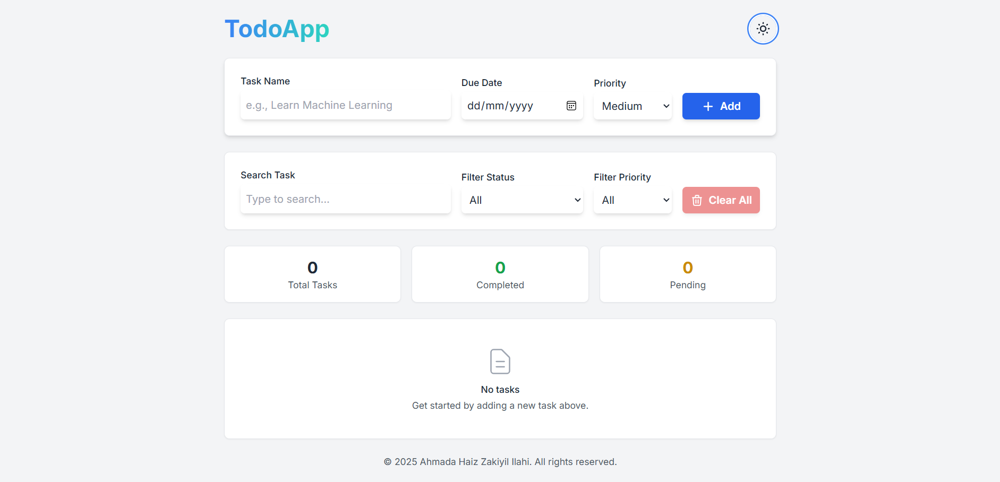
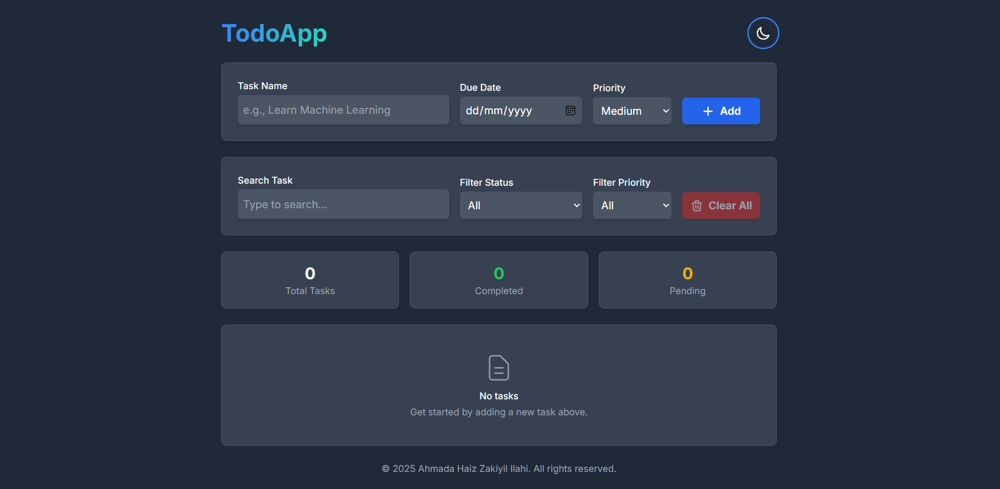

# TodoApp - A To-Do List Application

A responsive single-page web application for managing daily tasks. This application is built with HTML, Tailwind CSS, and JavaScript, utilizing the browser's Local Storage to persist data.

---

## Key Features

- **Add Tasks**: Users can add new tasks including a task name, due date, and priority level (Low, Medium, High).
- **Task Management**:
    - Mark tasks as **complete** or pending.
    - **Edit** existing task details (name, date, priority).
    - **Delete** tasks individually or all at once.
- **Search & Filtering**:
    - **Search Tasks**: Dynamically search for tasks by name.
    - **Filter by Status**: Filter tasks by their status (All, Completed, Pending).
    - **Filter by Priority**: Filter tasks by their priority level.
- **Local Storage**: All tasks are saved in the browser's **Local Storage**, so data persists even when the page is reloaded.
- **Task Statistics**: A concise display of the total number of tasks, as well as the counts for completed and pending tasks.
- **Dark/Light Mode**: Includes a toggle to switch the user interface between light and dark themes. The theme preference is also saved.
- **Responsive Design**: The layout adapts seamlessly to various screen sizes, from desktops to mobile devices.
- **Confirmation Modals**: Provides confirmation prompts before deleting a single task or clearing all tasks to prevent accidental data loss.

---

## Technologies Used

- **HTML5**: For the basic structure and content of the web application.
- **Tailwind CSS**: A utility-first CSS framework used for building the user interface quickly and efficiently.
- **JavaScript (ES6+)**: For all application logic, including DOM manipulation, event management, and interaction with Local Storage.

---

## Author

This project was created and is maintained by **Ahmada Haiz Zakiyil Ilahi**.

&copy; 2025 Ahmada Haiz Zakiyil Ilahi. All rights reserved.